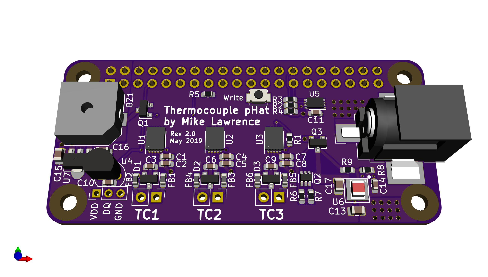

# Raspberry Pi Zero Thermocouple pHat
This is a Raspberry Pi Zero pHat PCB that supports:
* Four MAX31850 1-Wire Thermocouple Converters for remote temperature sensing
* DS18S20 1-Wire Thermometer for local pHat temperature
* Magnetic Buzzer/Alert

I keep an upright freezer in my garage and on two occasions I have had the freezer die without getting noticed for several days. IThis project is an attempt to solve my lack of constant oversight. MQTT is used to communicate with Home Assistant home automation software. The MQTT client/server model is very effective in this situation. Home Assistant will monitor the temperature and provide me with alerts so I can do something about the problem before all the food spoils.

This PCB design uses my custom libraries available here [Mike's KiCad Libraries](https://github.com/mikelawrence/KiCad-Libraries).

This PCB design is based on [RPi_Zero_pHat_Template](https://github.com/mikelawrence/RPi_Zero_pHat_Template).

This PCB was designed with [KiCad 5.1.2](http://kicad-pcb.org).

Note: The LMZ21700 Simple Switcher, AT24CS32, and MAX31850K parts have an exposed pad on the bottom which requires either a reflow oven or hot air to solder properly.

For Bill of Materials generation I use my version of [KiBoM](https://github.com/mikelawrence/KiBoM) forked from [SchrodingersGat](https://github.com/SchrodingersGat/KiBoM). 

## Status
* Rev 2.0 PCB has been ordered from OSH Park but has not been tested yet.
  * Removed one of the four MAX31850K's.
  * Added DC Power connector and switching power supply that powers both the Raspberry Pi and the pHat.
  * You can order parts from Mouser using this [shared BOM](https://www.mouser.com/ProjectManager/ProjectDetail.aspx?AccessID=bd69c35967).
  * You can order the PCB from OSH Park using this [link](https://oshpark.com/shared_projects/S5a4ZDvw).
* Rev 1.2 PCB has been ordered from OSH Park and tested.
  * Discovered the MAX31850K's get a noisy reading about 0.1% of the time. This noise is typically within 5 C but sometimes is greater than 30 C. Adding capacitors did little to help the Rev 1.1 design so most of the 3.3V power was switched to a 3.3V LDO regulator in an attempt to reduce the noise on the 3.3V power seen by the MAX31850K's.
  * You can order parts from Mouser using this [shared BOM](http://www.mouser.com/ProjectManager/ProjectDetail.aspx?AccessID=7612d46eeb).
  * You can order the PCB from OSH Park using this [link](https://oshpark.com/shared_projects/S5a4ZDvw).
* Rev 1.1 PCB was never built.
  * Added a pulldown on the alert signal to prevent the Alert buzzer from sounding on power on.
  * Added an on board DS18S20.
* Rev 1.0 PCB has been ordered from OSH Park and tested.
  * Discovered the linux kernel doesn't seem to support MAX31850K devices without a DS18S20 present. The kernel detects the MAX31850K devices but does not create a w1_slave file to read the temperature. This is most likely a bug in the Linux W1 driver.

## Board Preview


## Design
### Input Power
This pHat will safely power the Raspberry Pi and this board up to 650mA. The Barrel Jack will accept 11VAC or 6-17VDC. This input voltage is rectified and filtered and applied to a 5VDC Simpler Switcher module from Texas Instruments (LMZ21700). The output of this switcher is applied to the Raspberry Pi 5V through an ideal diode circuit which will prevent any problems when both the pHat and Raspberry Pi are powered simultaneously.

### MAX31850K Thermocouple-to-Digital Converter
Although the MAX38150K datasheet typical application circuit doesn't show the use of ferrite beads many designs seems to include them. That in combination with the larger than normal capacitor across the input will hopefully improve sampling errors even further.

## Raspberry Pi Setup
This setup makes two key assumptions. First you are using Raspbian Jessie. Second Python3 is the target programming environment. Python3 should be installed by default but if it isn't run `sudo apt-get install python3-dev`.

```
sudo apt-get update
sudo apt-get -y install git python3 python3-pip python3-rpi.gpio python3-w1thermsensor
sudo pip3 install paho-mqtt
```

### Configure ID EEPROM
Raspberry Pi Hats require an ID EEPROM with data that uniquely identifies every hat ever made. Start by cloning this repository on your Raspberry Pi, building the EEPROM tools, and make the the `eeprom_settings.eep` file.
```
cd ~/Documents
git clone https://github.com/mikelawrence/RPi-pHat-Thermocouple
cd ~/Documents/RPi-pHat-Thermocouple/eeprom/
make all
./eepmake eeprom_settings.txt eeprom_settings.eep
```
The next command writes the freshly generated and unique `eeprom_settings.eep` file to the EEPROM but you must push and hold the write switch on the hat before executing this command. By default the EEPROM on the hat is write protected. Pushing the write switch allows writes to occur while the switch is pushed.
```
sudo ./eepflash.sh -w -f=eeprom_settings.eep -t=24c32
```
You will see the following if writing to the EEPROM was successful.
```
This will attempt to talk to an eeprom at i2c address 0x50. Make sure there is an eeprom at this address.
This script comes with ABSOLUTELY no warranty. Continue only if you know what you are doing.
Do you wish to continue? (yes/no): yes
Writing...
0+1 records in
0+1 records out
117 bytes (117 B) copied, 2.31931 s, 0.1 kB/s
Done.
```
This is what you will see if there is a problem communicating with the EEPROM.
```
This will attempt to talk to an eeprom at i2c address 0x50. Make sure there is an eeprom at this address.
This script comes with ABSOLUTELY no warranty. Continue only if you know what you are doing.
Do you wish to continue? (yes/no): yes
Writing...
dd: error writing ‘/sys/class/i2c-adapter/i2c-3/3-0050/eeprom’: Connection timed out
0+1 records in
0+0 records out
0 bytes (0 B) copied, 0.0539977 s, 0.0 kB/s
Error doing I/O operation.
```
If you succesfuly wrote the EEPROM there is nothing else left to do here.

### Setup Interfaces
For this Hat you will need to enable the 1-Wire interface. From the command line type
`sudo raspi-config ` and follow the prompts to install  support in the kernel.


It's time to reboot your Raspberry Pi with `sudo reboot`.

### Test the 1-Wire Temperature Sensors
[Python3-w1thermsensor](https://github.com/timofurrer/w1thermsensor) is a nice 1-Wire python library that also supports command line reading of temperatures from 1-Wire devices. You should have already installed this package in the [Raspberry Pi Setup](#Raspberry-Pi-Setup) section.

Now test the RGBW LED Controller HAT's DS18B20 temperature sensor using `w1thermsensor all`.
```
pi@raspberrypi:~/projects/RPi-pHat-Thermocouple/code $ w1thermsensor all
Got temperatures of 5 sensors:
  Sensor 1 (4c9805e4f3a5) measured temperature: 25.5 celsius
  Sensor 2 (4c9805e4f36f) measured temperature: 25.5 celsius
  Sensor 3 (0008033ee178) measured temperature: 33.88 celsius
  Sensor 4 (4c9805e4f379) measured temperature: 25.5 celsius
```
