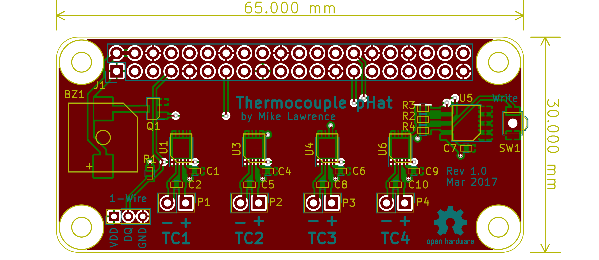
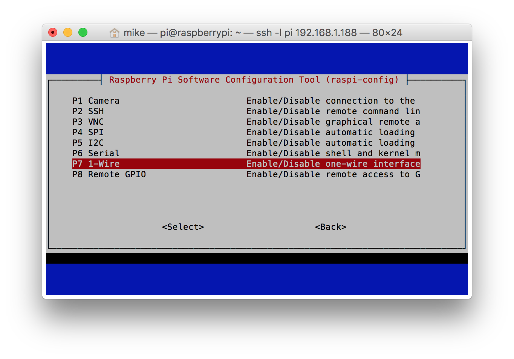
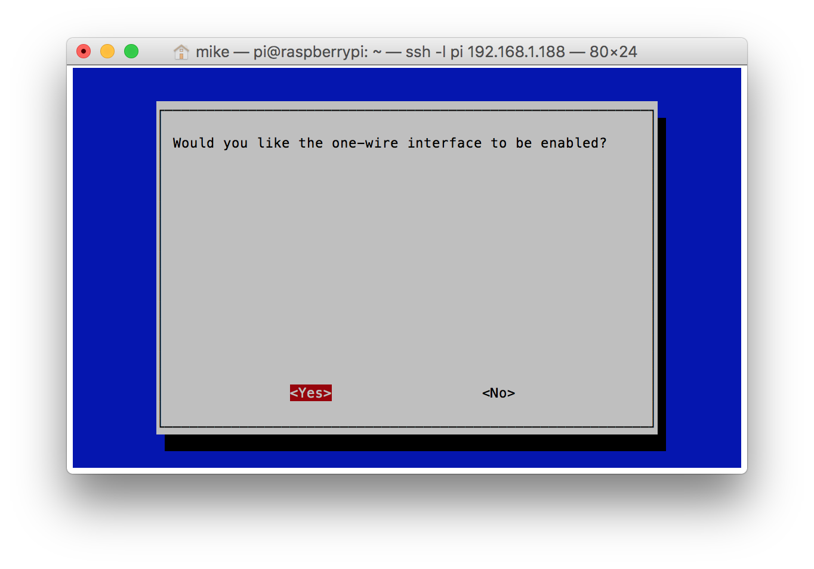

# Raspberry Pi Thermocouple Hat
This is a Raspberry Pi Zero pHat PCB that supports:
* Four MAX31850 1-Wire Thermocouple Converters for remote temperature sensing
* DS18S20 1-Wire Thermometer for local pHat temperature
* Magnetic Buzzer/Alert (Added with Rev 1.1)

PCB is designed in [KiCad](http://kicad-pcb.org) which is a great free EDA toolset and is based on [RPi_Zero_pHat_Template](https://github.com/mikelawrence/RPi_Zero_pHat_Template).

## Status
* Rev 1.0 PCB has been ordered from OSH Park but it currently untested becuase the boards haven't arrived yet.
  * You can order the PCB from OSH Park using this [link](https://oshpark.com/shared_projects/CVoI6Cf1).

## Board Preview


## Raspberry Pi Setup
This setup makes two key assumptions. First you are using Raspbian Jessie. Second Python3 is the target programming environment. Python3 should be installed by default but if it isn't run `sudo apt-get install python3-dev`.

### Configure ID EEPROM
Raspberry Pi Hats require an ID EEPROM with data that uniquely identifies every hat ever made. Start by cloning this repository on your Raspberry Pi, building the EEPROM tools, and make the the `eeprom_settings.eep` file.
```
cd ~/Documents
git clone https://github.com/mikelawrence/RPi-pHat-Thermocouple
cd ~/Documents/RPi-pHat-Thermocouple/eeprom/
make all
./eepmake eeprom_settings.txt eeprom_settings.eep
```
The next command writes the freshly generated and unique `eeprom_settings.eep` file to the EEPROM but you must push and hold the write switch on the hat before executing this command. By default the EEPROM on the hat is write protected. Pushing the write switch allows writes to occur while the switch is pushed.
```
sudo ./eepflash.sh -w -f=eeprom_settings.eep -t=24c32
```
You will see the following if writing to the EEPROM was successful.
```
This will attempt to talk to an eeprom at i2c address 0x50. Make sure there is an eeprom at this address.
This script comes with ABSOLUTELY no warranty. Continue only if you know what you are doing.
Do you wish to continue? (yes/no): yes
Writing...
0+1 records in
0+1 records out
117 bytes (117 B) copied, 2.31931 s, 0.1 kB/s
Done.
```
This is what you will see if there is a problem communicating with the EEPROM.
```
This will attempt to talk to an eeprom at i2c address 0x50. Make sure there is an eeprom at this address.
This script comes with ABSOLUTELY no warranty. Continue only if you know what you are doing.
Do you wish to continue? (yes/no): yes
Writing...
dd: error writing ‘/sys/class/i2c-adapter/i2c-3/3-0050/eeprom’: Connection timed out
0+1 records in
0+0 records out
0 bytes (0 B) copied, 0.0539977 s, 0.0 kB/s
Error doing I/O operation.
```
If you succesfuly wrote the EEPROM there is nothing else left to do here.

### Setup Interfaces
For this Hat you will need to enable the 1-Wire interface. From the command line type
`sudo raspi-config ` and follow the prompts to install  support in the kernel.



It's time to reboot your Raspberry Pi with `sudo reboot`.
